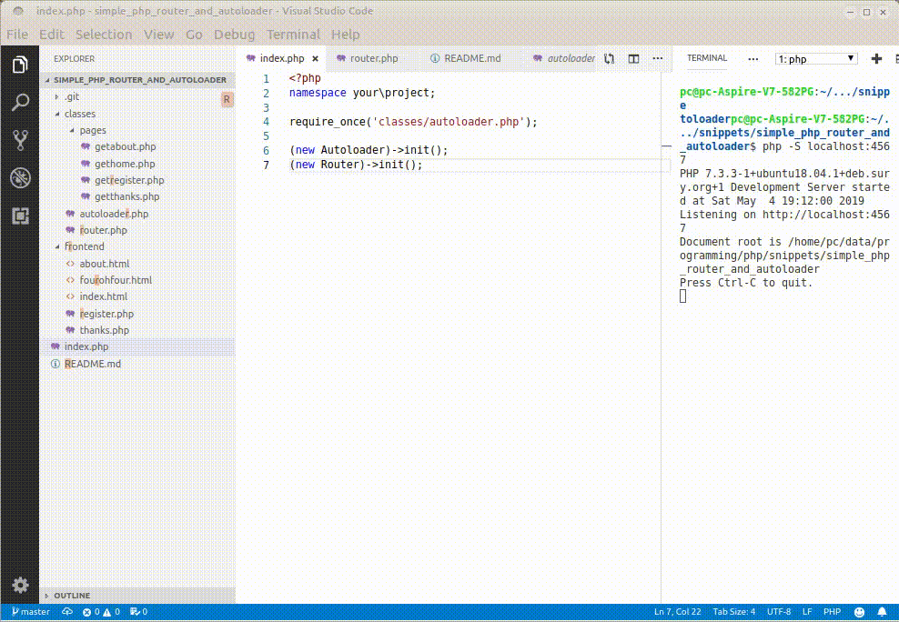

# simple php router and autoloader

 

About as simple as it gets and still be useful



## how does it work

`Autoloader.php` scans all files/folders within `/classes` (or your choice of folder) for required classes, loads them, and executes a method called `init()`.

`Router.php` translates the route in a browser to a php class and executes the `init()` method in that class.

## installation

* copy file to a directory of your choice
* open the directory with a terminal/console/cli
* start with `php -S localhost:4567`
* use a browser to navigate to `localhost:4567`
* try the routes in lines 9 - 11 of router.php:
	* localhost:4568
	* localhost:4568/about
	* localhost:4568/enrol

## structure

Looks like this:
```
-------------------------------------------------------------------------------
 Language            Files        Lines         Code     Comments       Blanks
-------------------------------------------------------------------------------
 HTML                    2           20           20            0            0
 Markdown                1           24           24            0            0
 PHP                     4          122           67           41           14
-------------------------------------------------------------------------------
 Total                   7          166          111           41           14
 .
├── classes
│   ├── autoloader.php
│   ├── pages
│   │   └── gethome.php
│   └── router.php
├── frontend
│   ├── fourohfour.html
│   └── index.html
├── index.php
└── README.md
 ```
Help yourself to the code, and if it's of any use then a star would be nice (top right...)